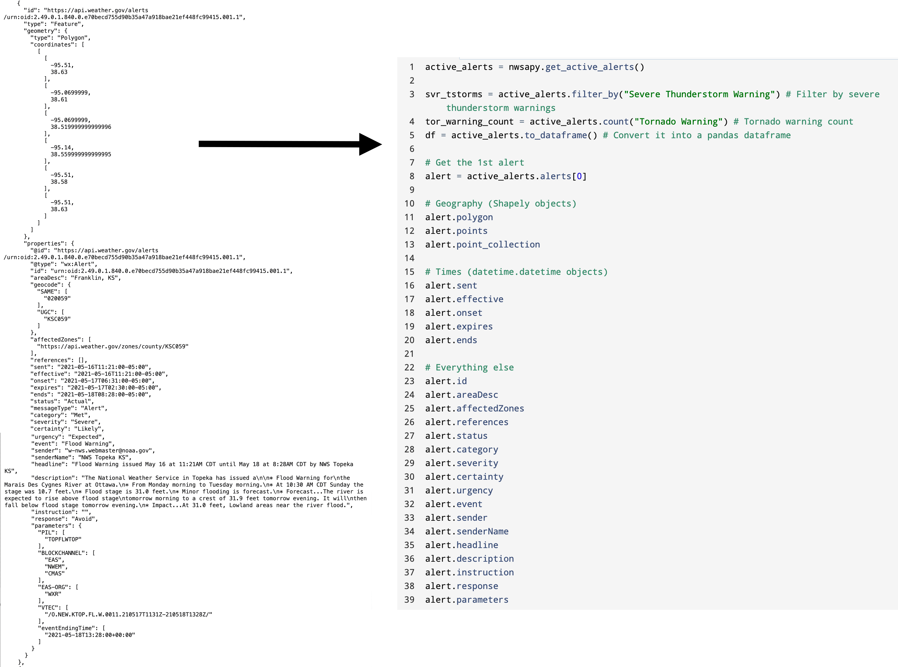

# NWS-APy: An Object-Oriented Approach to the National Weather Service API

NWS-APy takes an object-oriented approach to retrieving (GET) and organizing data using the National Weather Service API (found here: https://www.weather.gov/documentation/services-web-api#/)

There's a few advantages to using this package:
- **Clean and Simplistic Code** - The syntax is very english-like.
- **No worries about JSON**. NWSAPy takes care of anything JSON-related, including formats (GeoJSON, JSON-LD, etc).
- **404 Error Minimization.** This is handled through data validation checks, as well as handling URL construction.
- **Response errors are handled.** Response errors are handled appropriately.
- **Consistency matters.** Even if the response doesn't have a specific attribute, NWSAPy makes sure *something* exists so your code doesn't break.

As a visual example, the left side of the image below is a typical JSON response from the API. NWSAPy takes this and converts it into an object, as shown on the right. There are also built-in methods to help with filtering, counting, and even converting the information into a dataframe.

## Documentation

Documentation for NWSAPy be found [here](https://nwsapy.readthedocs.io/en/latest/index.html)

## Contact/Support

I want to hear from you. If you have any questions regarding the package usage, please [send me an email](mailto:brandonmolyneaux@tornadotalk.com). If you encounter an issue, please open an issue on GitHub.
